# Payment System Logos
A collection of logos for payment systems
Every logo is available in png and svg, colored and gray

## Creditcards

### VISA
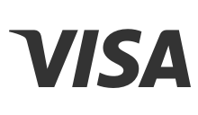

### VISA Secure
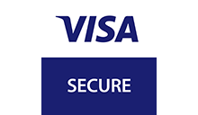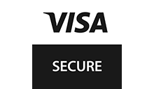

### Mastercard
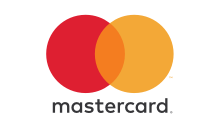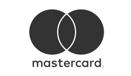

### Mastercard ID Check
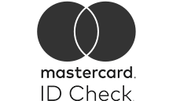

### AMEX

### DINERS

### JCB
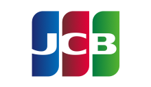

## Wallets

### AliPay
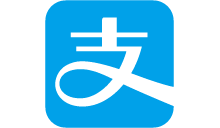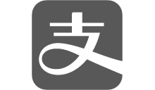

### WeChat Pay

## Direct transfer

### Unzer Bank Transfer

### iDeal
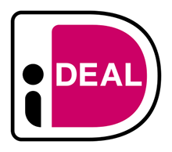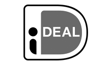

## Online Banking and more

### EPS

### Giropay
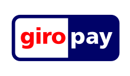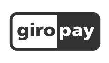

### Maestro

### Paypal

### Klarna

### Paysafecard
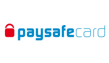

## Unzer Payments

### Unzer Bank Transfer

### Unzer Invoice

### Unzer Instalment

### Unzer Direct Debit
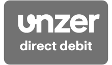

## Direct Debit Hire Purchase and Invoice

### SEPA
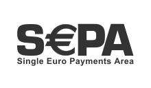

### Billpay

## Disclaimer

All trademarks are the property of their respective owners; third-party brands, product names, trade names, corporate names and companies mentioned herein may be the trademarks of their respective owners or registered trademarks of other companies and have been used for purposes of explanation and to the owner's benefit, without implying a violation of copyright law.
